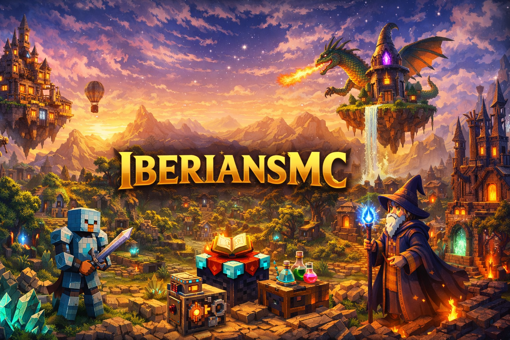

> **Servidor Survival Minecraft 1.20.1 Forge**  
> IP: `iberians.modded.fun` | RAM: 8GB recomendada | **Código CurseForge**: `SlK8gJY7`

---

## 🏰 Guía del Servidor

Todo lo que necesitas para entrar al servidor, instalar el modpack y empezar a jugar sin complicaciones.

### 🚀 Comienza Aquí

| Sección | Descripción | Enlace |
|---------|-------------|--------|
| 📦 **Instalación** | Guía paso a paso para instalar el pack de mods | [Ver Guía](guia-instalacion) |
| 🔧 **Lista de Mods** | Todos los mods disponibles y sus funciones | [Ver Mods](lista-mods) |
| ⌨️ **Comandos** | Comandos útiles y atajos del servidor | [Ver Comandos](comandos) |

---

## 🎮 Información Rápida

### 📋 Requisitos Mínimos
- **Minecraft**: 1.20.1 con Forge
- **RAM**: 8GB recomendada (6GB mínima)
- **Java**: Versión 17 o superior
- **Espacio**: 2GB libres para mods

### 🔗 Enlaces Importantes
- **Web Principal**: [evilthork.github.io](https://evilthork.github.io/iberiansmc)
- **IP del Servidor**: `iberians.modded.fun`
- **Código Forge**: `SlK8gJY7` (válido hasta 02/03/2026)
- **Discord**: [PENDIENTE]

### 🌟 Características Principales
- ✅ **100+ Mods** organizados por categorías
- ✅ **Protección de Terrenos** con FTB Chunks
- ✅ **Mundo Expansivo** con biomas únicos
- ✅ **Magia y Tecnología** en equilibrio perfecto
- ✅ **Comunidad Activa** y colaborativa

---

## � **Sistema de Magia - Iron's Spells**

### 📚 **Escuelas de Magia Disponibles**
- 🔥 **Fuego** - Magia destructiva y explosiones
- ❄️ **Hielo** - Control y congelación
- ⚡ **Rayo** - Ataques eléctricos rápidos
- ✨ **Santo** - Magia curativa y protectora
- 🩸 **Sangre** - Magia sacrificial y poderosa
- 🌀 **Ender** - Teletransporte y manipulación espacial
- 🔮 **Evocación** - Invocaciones y summoning
- 🌑 **Vacío** - Magia oscura y corruptora
- ☠️ **Veneno** - Degradación y efectos tóxicos

### 🛠️ **Estaciones de Artesanía Mágica**
- **Forja de Pergaminos** - Crea hechizos personalizados con tintas y focos
- **Yunque Arcano** - Mejora equipo mágico y combina objetos
- **Mesa de Inscripción** - Inscribe runas de poder

### ⚔️ **Equipo Mágico**
- **10 conjuntos de armadura** - Uno por cada escuela + 2 básicos
- **Libros de Hechizos** - Desde hierro hasta netherite (5 fabricables + 2 únicos + 3 encontrados)
- **Objetos arcanos** - Esencia, runas, tintas mágicas y materiales raros

### 🎯 **Materiales Esenciales**
- **🖋️ Tintas Mágicas** - Determinan rareza de hechizos (5 niveles)
- **🎯 Focos de Poder** - Requeridos para cada escuela (9 tipos)
- **💎 Esencia Arcana** - Material base para objetos mágicos
- **🗿 Runas Mágicas** - Grabadas para especialización escolar

---

## �🗺️ Navegación Rápida

### 📦 Para Nuevos Jugadores
1. [Lee la guía de instalación](guia-instalacion)
2. [Usa el código CurseForge](guia-instalacion#método-1-curseforge-app-recomendado)
3. [Conéctate al servidor](iberians.modded.fun)
4. [Únete a nuestro Discord](#) (próximamente)

### 🔧 Para Jugadores Experimentados
- [Ver lista completa de mods](lista-mods)
- [Comandos avanzados](comandos)
- [Configuración de FTB Chunks](guia-instalacion#ftb-chunks)

---

## 🤝 Contribuir a la Wiki

¿Tienes información útil para compartir? ¡Ayúdanos a mejorar esta documentación!

### 📝 Cómo Contribuir
1. **Reporta errores** o información desactualizada
2. **Sugiere mejoras** para el servidor y documentación
3. **Comparte tu experiencia** con otros jugadores

### 📧 Contacto
- **Discord**: [PENDIENTE]
- **Issues de GitHub**: [Reportar Problema](https://github.com/evilthork/iberiansmc/issues)

---

## 📊 Estadísticas del Servidor

| Métrica | Valor |
|---------|-------|
| **Versión** | 1.20.1 Forge |
| **Mods Instalados** | 100+ |
| **Biomas Únicos** | 50+ |
| **Capacidad** | 30+ jugadores |
| **Uptime** | 99.9% |

---

## 🎯 Últimas Actualizaciones

- **22/02/2026**: Wiki creada con guía de instalación
- **22/02/2026**: Código Forge temporal activo
- **22/02/2026**: Web principal actualizada

---

## 📄 Licencia

Esta documentación está disponible bajo licencia Creative Commons. Puedes compartirla y modificarla para uso educativo.

---

**¡Prepárate para vivir la aventura más épica de Minecraft!** 🎮✨

*Última actualización: 22 de febrero de 2026*
